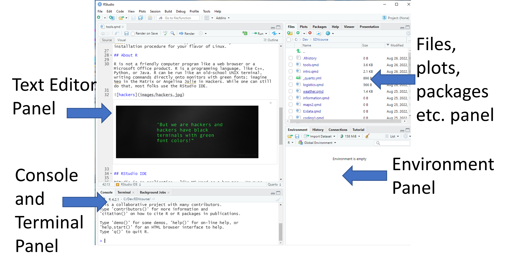



# Coding - Basics {#sec-coding}

Coding is a set of precise text-based instructions to a computer. Each programming language has its own set of syntax, vocabulary, and jargon.

It is a foreign language.

Today, I'll teach you in R, which is my current preferred language. Data visualization is a great place to start with R programming, because the payoff is relatively immediate. You get to make informative and potentially elegant visualizations to help you understand data.

## Coding - most Basic

```{webr}
print("Hello World")
1 + 1
print("My name is Mike McCarthy")
```

## Stepwise R Data Science Framework

0. **Step 0** - [Install R and RStudio](https://radicalresearch.llc/ScrippsDemo/tools.html) 
1. **Step 1 - Open RStudio **  
2. **Step 2 - Packages**  
  A. Install key packages  
  B. Load key packages  
3. **Step 3 - Acquire and/or Load Data**  
  A. Identify the `path` to the data   
  B. Identify the data format  
  C. Choose the _right_ function to load the data - go to _Step 2A_ and _2B_ again as needed
  D. Write code to import the data  
  E. Run the code to import the data  
    i) Check for Error messages and warning messages in console; if failure, go back to _Step 2D_    
    ii) Check to make sure data is loaded (look in `Environment` window)   
  F. Look at the data - did it import correctly? 
    i) Check column headers  
    ii) Check data types  
  G. Repeat Step 2 as needed for any other data required for visualization    
3. **Step 3 - Tidy the data** [Advanced data science](https://r4ds.had.co.nz/tidy-data.html) 
4. **Step 4 - Visualize the data**  
  A. Choose the visualization type  
  B. Choose the _right_ functions  
  C. Write code to do a _basic_ visualization  
  D. Add code to improve the visualization (repeat as needed)  
  E. Annotate labels, axes, points, legends  
  F. Export or publish the visualization  
5. **Step 5 - Communicate with your audience using the visualization**
  A. Get feedback from audience
  B. Revise visualization (Step 4D as needed) to improve for intended audience

## RStudio IDE orientation

::: {.callout-note appearance="warning"}
Opening RStudio loads R.  
Opening R will not load RStudio.  
:::

@fig-annotated shows an annotated image of RStudio with the four panels labeled. In the default layout, the top-left is the _text editor panel_, the bottom-left is the _console panel_,
the top-right is the _files, plots, and packages panel_, and the bottom-right is the _environment panel_.  

{#fig-annotated}

* Text Editor Panel - This is where you can enter code and have the editor color code it.
* Console Panel - This is where errors and warnings appear when you run code. It can also be used to do direct coding, which I don't recommend for beginners.
* Files, plots, and packages panels - This is where files loaded in the working directory and packages in the default R directory are organized.
* Environment Panel - This is where data and variables you define in your coding will be organized


