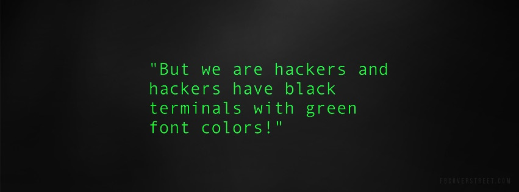
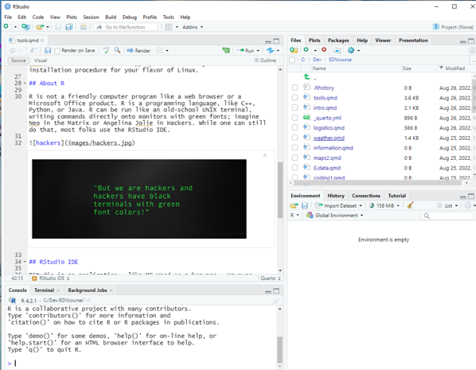
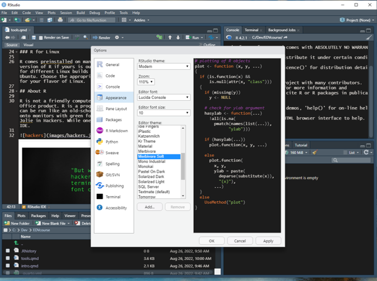

# R and RStudio Installation and Overview {#sec-appendix-tools}

[R](https://cran.r-project.org/) is a free software environment for statistical computing and graphics.\
Current version 4.5.3 "Reassured Reassurer" was released March 11, 2026

[RStudio](https://posit.co/download/rstudio-desktop/) is an integrated development environment (IDE) for R. It is available in open source and commercial editions. This lecture is using RStudio 2026.01.2+418.  

[Posit Cloud](https://posit.cloud/) is an online version that has a free version but is mostly a subscription Softward-as-a-Service model of the same tools. This is an option for those who prefer licensing and throttled use features.  

These tools will be the primary software used in this course to develop environmental visualizations. Alternate tools/software can be used for assignments and projects, but I will not devote class time to troubleshooting those tools/software.

## Download and Install R

R is maintained and made available through the web-page at [The Comprehensive R Archive Network](https://cran.r-project.org/) aka CRAN.

The top of the CRAN web page provides three links for downloading R. Follow the link that describes the OS of your computer: Mac, Windows, or Linux.

### R for macOS

To install R on a Mac, click the **"Download R for macOS"** link. Next, click on the R-4.5.3 package link (or the package link for the most current release of R). An installer will download to guide you through the installation process. As a starting point, I recommend that most users should choose the default installation settings until they are familiar with R.

### R for Windows

To install R on Windows, click the **"Download R for Windows"** link. Next, click on the **install R for the first time** link which contains base R. Then click on the link that says **Download R-4.5.3 for Windows**. A win.exe file will be downloaded to your downloads folder. Open that file after it downloads and follow the installation process. As a starting point, I recommend that most users should choose the default installation settings until they are familiar with R.

### R for Linux

R comes preinstalled on many Linux systems, but update to the newest version of R if yours is out of date. The CRAN website provides files for different Linux builds including Debian, Fedora, Redhat, Suse, and Ubuntu. Choose the appropriate directory and the installation procedure for your flavor of Linux.

## About R

R is not a friendly computer program like a web browser or a Microsoft Office product. R is a programming language, like C++, Python, or Java. R can be run like an old-school UNIX terminal, writing commands directly onto monitors with green fonts; imagine Neo in the Matrix or Angelina Jolie in Hackers. While one can still do that, most folks use an IDE.

## RStudio IDE

RStudio is an application - like MS Word or a browser. However, Rstudio is an app that helps you write in the "R" language. It is literally a foreign language (unless you know it already). And just like any language, R has its own syntax, grammar, and vocabulary. It takes training and time to learn R, or any programming language

I recommend RStudio because it makes using R much easier. Also, the RStudio interface looks about the same for different operating systems, which will help me because I am a Windows user and I've observed that Claremont Colleges' scholars tend to lean towards macOS.

[Download RStudio desktop here](https://www.rstudio.com/products/rstudio/download/#download) - I recommend the free open source version. Make sure to pick the version that is appropriate for your OS. Then follow the installation instructions.

Once installed, RStudio can be opened like any other program or app on your computer; usually just click on the icon on the desktop. When you open it, it should look something like @fig-RStudio.

{#fig-RStudio}

Here, there are four separate windows or "Panels".

-   The source panel is top-left and this is basically a text editor where you type R code or regular text. Code here gets colored and looks different if it is doing various R things. More on this later. Code doesn't get immediately executed here; it is more like a holding place for writing/testing/debugging bigger "scripts" or programs.
-   The console/terminal is bottom-left. The terminal is the 1980s window that does commands directly. Type print('Hello World'), press enter/return, and you've written some code. This console is what R would look like if you ran it without RStudio.
-   The top-right is the file manager panel. It shows files in your directory, plots, packages, and help files.
-   The bottom-right is the programming environment. It contains things you've loaded or coded. Right now it should be empty because you've done neither.

Of course all of these can be moved around to match how you like to set it up. And I need a different color-scheme than the ugly default.

Select the **Tools** menu, followed by **Global Options** in the dropdown Tools menu. Navigate to appearance and you should be able to alter the color scheme to something more your style. My preferred style is **Merbivore Soft** as shown in @fig-goodRStudio.

{#fig-goodRStudio}

